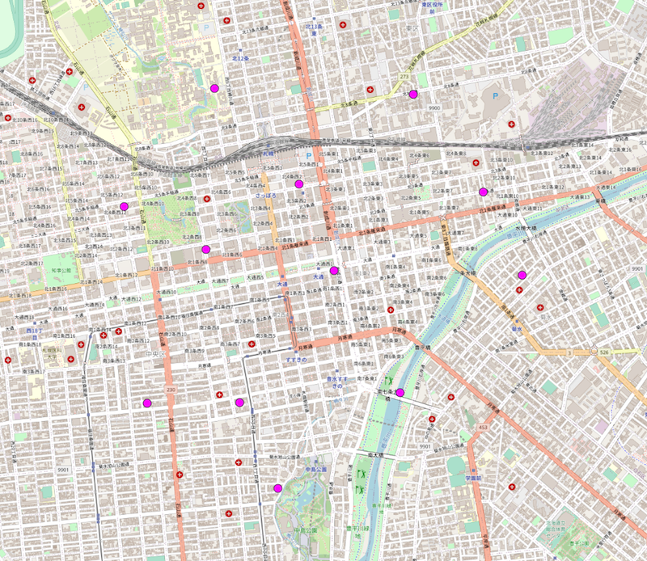
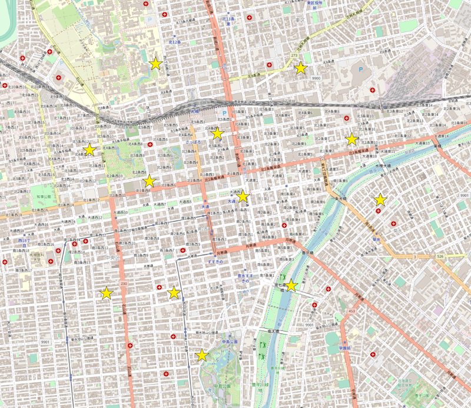
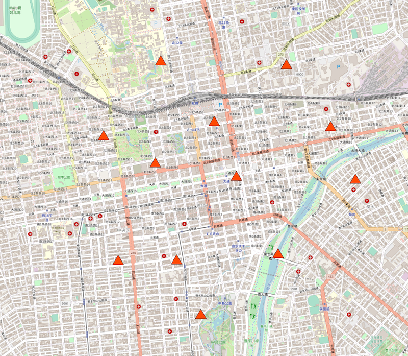

# geo-biscuit

## what is this

Transform points to MultiPolygon by a shape.  
`geo-biscuit` is named because it is similar to biscuit-cutter.

-   original points

    

-   transformed poylgons (star, scaler=100)

    

-   transformed poylgons (triangle, scaler=100)

    

## usage

### JavaScript/TypeScript

```sh
npm install geo-biscuit
```

```typescript
import { getBiscuitCutter } from './index';

// get cutter function
const biscuitCutter = getBiscuitCutter('star', {
    scaler: 100, // size-multiplier
});

const biscuits = biscuitCutter(geojson); // geojson = FeatureCollection
console.log(biscuits); // MultiPolygon-FeatureCollection
```

### CLI

```sh
npm install -g geo-biscuit
```

```sh
geo-biscuit --input ./example/input.geojson --output ./example/output.geojson --shape triangle --scaler 100
```
