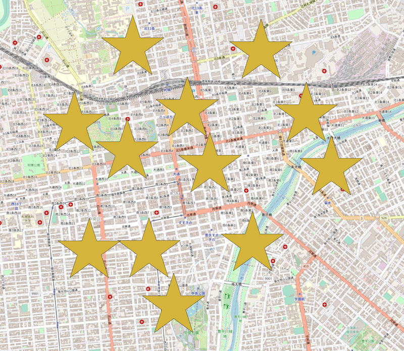

# geo-biscuit

## what is this

Transform points to MultiPolygon by a shape.  
`geo-biscuit` is named because it is similar to biscuit-cutter.

-   original points

    

-   transformed poylgons (star, scaler=100)

    

-   transformed poylgons (triangle, scaler=100)

    

-   transformed poylgons (triangle, scaler=500)

    

## usage

### JavaScript/TypeScript

```sh
npm install geo-biscuit
```

```typescript
import { getBiscuitCutter } from './index';

// get cutter function
const biscuitCutter = getBiscuitCutter('star', {
    scaler: 100, // size-multiplier
});

const biscuits = biscuitCutter(geojson); // geojson = FeatureCollection
console.log(biscuits); // MultiPolygon-FeatureCollection
```

### CLI

```sh
npm install -g geo-biscuit
```

```
usage: geo-biscuit [-h] [-v] [-i INPUT] [-o OUTPUT] [--shape SHAPE] [--scaler SCALER]

optional arguments:
  -h, --help            show this help message and exit
  -v, --version         show program's version number and exit
  -i INPUT, --input INPUT
                        input geojson path
  -o OUTPUT, --output OUTPUT
                        output geojson path
  --shape SHAPE         biscuit-cutter name, triangle, square...
  --scaler SCALER       polygon size multiplier, default to 1.0
```

#### example

```sh
geo-biscuit --input ./example/input.geojson --output ./example/output.geojson --shape triangle --scaler 100
```

## preset shape names

-   triangle
-   square
-   pentagon
-   star

## custom shape

You also can make `custom shape` poylgons.

```typescript
const biscuitCutter = getBiscuitCutter('custom', {
    // define custom shape by MultiPolygon Geometry
    shape: [
        [
            [
                [0, 1],
                [0.866, 0.5],
                [0.866, -0.5],
                [0, -1],
                [-0.866, -0.5],
                [-0.866, 0.5],
                [0, 1],
            ], // hexagon
        ],
    ],
    scaler: 100,
});

const biscuits = biscuitCutter(geojson);
console.log(biscuits); // hexagons
```
